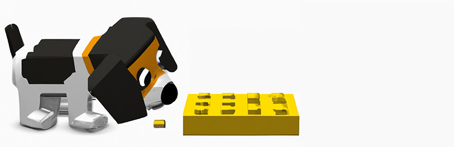

# debug-compat
Get debug information for Block Compatibility.

Debug Compat allows you to see, within the Site Health screen, which plugins and themes use block-related functions, and which specific functions are used.

Be sure to set Block Compatibility to "Troubleshooting".
